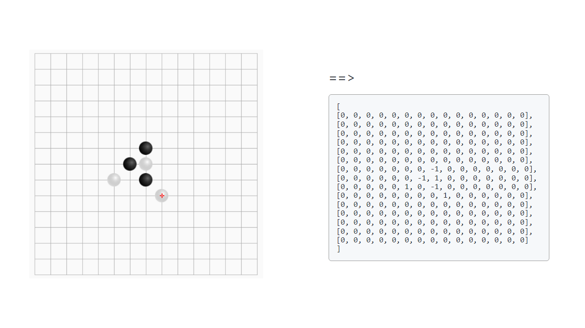

# 白黑子棋盘识别API

>黑白棋棋盘识别API、 五子棋棋盘识别API、围棋棋盘识别API

## 为何创建？
玩五子棋总是输，想借用强的五子棋人工智能帮助我（~~辅助~~）。我想我要做的第一步就是识别一个棋盘上的黑白子，考虑到使用黑白子的棋局不仅仅有五子棋还有其他类型的棋局所以命名为“黑白子棋盘识别”。

恰巧发现了一个叫FastAPI的框架，我想只需要提供一个标准的棋盘（最初是较为规则，由电脑绘制的那种）的截图图片，发送给API接口就会返回一个有0、1的棋盘。为了让他更好玩，不必指定棋盘大小无论是9 * 9或者15 * 15还是 32 * 32，（~~甚至可以是非正方形~~）。

 

**那么就由学习FastAPI框架开始吧！**